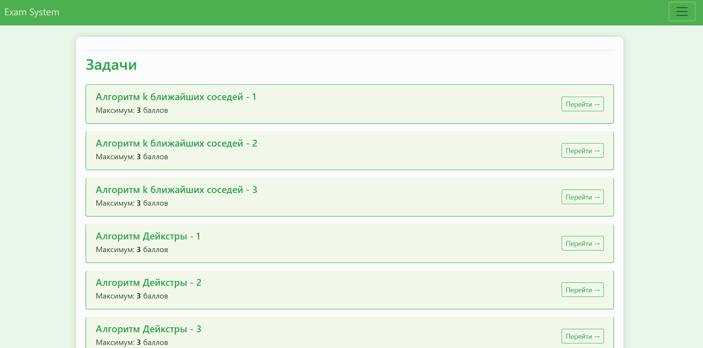
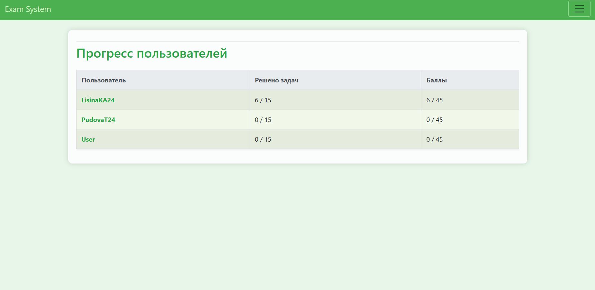

# Algorithm Exam System (Django)

Веб-приложение для проведения экзамена по алгоритмам с системой проверки, оценивания и отслеживания результатов пользователей.

Проект разработан на 2 курсе колледжа в рамках итоговой работы по дисциплине «Алгоритмы».

## О проекте

Проект представляет собой систему для проведения экзамена, где пользователи решают задачи по алгоритмам, а администратор проверяет решения и выставляет баллы.

Платформа позволяет отслеживать прогресс пользователей, хранить результаты и управлять заданиями через административную часть.

## Демо




## Задача проекта
 - разработать систему экзамена по алгоритмам
 - реализовать хранение и управление задачами
 - создать интерфейс для пользователей и администратора
 - реализовать систему оценки решений
 - обеспечить хранение результатов экзамена

## Функционал

 - регистрация и авторизация пользователей
 - прохождение экзамена (решение задач)
 - отображение статусов задач:
     - «Не решена»
     - «В работе»
     - «Проверена»
 - выставление баллов администратором
 - отображение результатов и итогового балла
 - хранение данных в базе

## Технологии
 - Python
 - Django
 - SQLite3
 - HTML / CSS
 - Django Templates

## Роль в проекте

**Выполненные задачи:**

 - разработка backend-логики приложения
 - проектирование структуры базы данных
 - реализация системы пользователей
 - создание моделей задач и решений
 - реализация логики оценки и проверки
 - настройка административной панели
 - разработка шаблонов интерфейса

## Что решает проект

**Проект позволяет:**

 - организовать процесс проведения экзамена
 - централизованно проверять решения
 - хранить и анализировать результаты
 - автоматизировать контроль выполнения заданий

## Практикуемые навыки
 - работа с Django (models, views, templates)
 - проектирование базы данных
 - реализация аутентификации пользователей
 - разработка CRUD-логики
 - работа с формами
 - построение backend-архитектуры
 - управление ролями (администратор / пользователь)

## Структура проекта
```
exam_algoritm/
├── exam/
│   ├── exams/        # логика экзамена
│   ├── users/        # пользователи
│   ├── media/        # загруженные файлы
│   ├── exam/         # настройки проекта
│   ├── db.sqlite3
│   └── manage.py
│
├── requirements.txt
└── ll_env/
```

## Запуск проекта
**активировать окружение (Windows)**
```
cd exam_algoritm
ll_env\Scripts\activate
```

**запустить сервер**
```
cd exam
python manage.py runserver
```

**После запуска:**

http://127.0.0.1:8000

## Итог

Проект стал итоговой работой по дисциплине «Алгоритмы» и позволил применить знания на практике в виде полноценного веб-приложения.

В ходе разработки были освоены:

 - построение backend-приложений на Django
 - работа с базами данных
 - реализация систем оценки и логики экзаменов
 - организация пользовательских ролей
